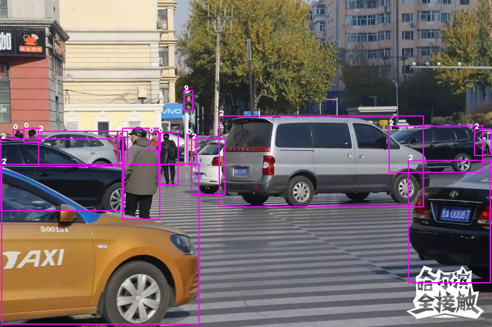

# Speed up YOLOv5-v5.0 inferencing with TensorRT v8.2
[README中文版](https://github.com/emptysoal/TensorRT-v8-YOLOv5-v5.0/blob/main/README-chinese.md)

## Introduction

- Build YOLO network using TensorRT native API, convert PyTorch model into .plan serialized file, speed up model inference; 
- Based on TensorRT version 8.2.4, see the environment construction section below for details; 
- Reference project : [tensorrtx](https://github.com/wang-xinyu/tensorrtx) ，But I made a lot of changes according to my own programming habits;



## Specialty

- The comparison here is different from the YOLOv5-v5.0 in the [tensorrtx](https://github.com/wang-xinyu/tensorrtx) project, not to say which is better or worse, but some places are more in line with my personal habits 

|      | tensorrtx                                                    | this                                                         | remark                                                       |
| ---- | ------------------------------------------------------------ | ------------------------------------------------------------ | ------------------------------------------------------------ |
| 1    | implicit batch size                                          | explicit batch size                                          | This is the biggest difference, and it's where many of the differences in the code come from |
| 2    | The Detect Plugin inherits from IPluginV2IOExt               | The Detect Plugin inherits from IPluginV2DynamicExt          |                                                              |
| 3    | The Detect Plugin is compiled as a dynamic link library      | The Detect Plugin compiles directly to the final executable  |                                                              |
| 4    | Asynchronous inference（context.enqueue）                    | Synchronous inference（context.executeV2）                   | There is no difference in speed, and synchronous writing is more convenient |
| 5    | INT8 quantization uses the dnn module of OpenCV to convert the image into a tensor | When INT8 quantizes, a custom method converts the image into a tensor |                                                              |
| 6    | C++ and opencv to implement preprocessing                    | cuda programming speed up image preprocessing                | Later versions of v5.0 also have cuda preprocess, there are two different implementations |
| 7    | CMakeLists.txt                                               | Makefile                                                     |                                                              |

In addition to the above, there are many other coding differences, not to go into details. 

## Inference speed

- Based on GPU：GeForce RTX 2080 Ti

| FP32  | FP16 | INT8 |
| :---: | :--: | :--: |
| 17 ms | 7 ms | 4 ms |

Note: The inference time of this project includes: pre-processing, model forward and post-processing, while the tensorrtx project only calculates the model forward time. 

## Environment

### Base environment

- Ubuntu 16.04
- GPU：GeForce RTX 2080 Ti
- docker，nvidia-docker

### Base image pull

```bash
docker pull nvcr.io/nvidia/tensorrt:22.04-py3
```

- The library versions in the image are as follows:

|  CUDA  |  cuDNN   | TensorRT | python |
| :----: | :------: | :------: | :----: |
| 11.6.2 | 8.4.0.27 | 8.2.4.2  | 3.8.10 |

### Install other libraries

1. build docker container

   ```bash
   docker run -it --gpus device=0 --shm-size 32G -v /home:/workspace nvcr.io/nvidia/tensorrt:22.04-py3 bash
   ```

   -v /home:/workspace Mounts the /home directory of the host to the container to facilitate file interaction. You can also select other directories 

2. install OpenCV-4.5.0

   - OpenCV-4.5.0 source link is as follows, download the zip package, decompress it and put it in the host `/home` directory, that is, the container `/workspace` directory 

   ```bash
   https://github.com/opencv/opencv
   ```

   - The following operations are in the container

   ```bash
   # Install dependency
   apt install build-essential
   apt install libgtk2.0-dev pkg-config libavcodec-dev libavformat-dev libswscale-dev
   apt install libtbb2 libtbb-dev libjpeg-dev libpng-dev libtiff-dev libdc1394-22-dev
   # start to install OpenCV
   cd /workspace/opencv-4.5.0
   mkdir build
   cd build
   cmake -D CMAKE_INSTALL_PREFIX=/usr/local -D CMAKE_BUILD_TYPE=Release -D OPENCV_GENERATE_PKGCONFIG=ON -D OPENCV_ENABLE_NONFREE=True ..
   make -j6
   make install
   ```

## Running

1. get file `.wts` 

- process：copy the `pth2wts.py` file of this project to the official `yolov5-v5.0` directory and run `python pth2wts.py` in the official `yolov5-v5.0` directory to get the `para.wts` file 
- Refer to the steps below for details 

```bash
git clone -b v5.0 https://github.com/ultralytics/yolov5.git
git clone https://github.com/emptysoal/yolov5-v5.0_tensorrt-v8.2.git
# download https://github.com/ultralytics/yolov5/releases/download/v5.0/yolov5s.pt
cp {tensorrt}/pth2wts.py {ultralytics}/yolov5
cd {ultralytics}/yolov5
python pth2wts.py
# a file 'para.wts' will be generated.
```

2. get tensorrt serialized file, and inference

- process：copy the `para.wts` file generated in the previous step into this project directory, and run `make` and `./trt_infer` in this project 
- Refer to the steps below for details 

```bash
cp {ultralytics}/yolov5/para.wts {tensorrt}/
cd {tensorrt}/
mkdir images  # and put some images in it
# update CLASS_NUM in yololayer.h if your model is trained on custom dataset
# you can also update INPUT_H、INPUT_W in yololayer.h, update NET(s/m/l/x) in trt_infer.cpp
make
./trt_infer
# result images will be generated in present dir
# tensorrt serialized file : model.plan will be generated in present dir
```

